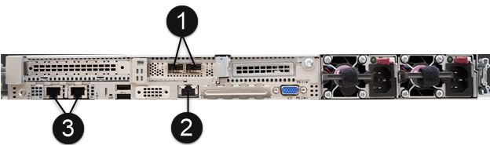

= Effectuez les tâches préalables à l'installation
:allow-uri-read: 
:icons: font
:imagesdir: ../media/

[role="lead"]
Avant d'installer SolidFire ESDS, assurez-vous que vous effectuez les vérifications nécessaires et que votre environnement répond aux exigences de configuration, d'adressage IP et de mise en réseau.

.*Installer le matériel requis*
* Installez le serveur pris en charge. Voir https://mysupport.netapp.com/matrix/imt.jsp?components=97283;&solution=1757&isHWU#welcome["Matrice d'interopérabilité NetApp (connexion requise)"^] pour en savoir plus.
* Vérifiez que la configuration matérielle est équilibrée et que tous les canaux sont remplis. Pour plus d'informations sur l'optimisation de la bande passante, reportez-vous au https://kb.netapp.com/Advice_and_Troubleshooting/Data_Storage_Software/SolidFire_Enterprise_SDS/How_to_balance_memory_and_maximize_bandwidth_for_your_hardware_configurations["Article de la base de connaissances"^] (connexion requise).

.*Configurer l'hôte (nœud)*
* Installez Red Hat Package Manager en fonction des versions prises en charge répertoriées dans https://mysupport.netapp.com/matrix/imt.jsp?components=97283;&solution=1757&isHWU#welcome["Matrice d'interopérabilité NetApp (connexion requise)"^].
* Configurez un serveur NTP (Network Time Protocol) à utiliser avec tous les hôtes de votre réseau.
* Lorsque vous sélectionnez la destination d'installation, sélectionnez le bouton radio pour configurer manuellement le partitionnement du système de fichiers. Sur la page *Partitionnement manuel*, utilisez les boutons *+* et *-* pour supprimer toutes les partitions existantes et créer de nouvelles partitions et les dimensionner en suivant les recommandations indiquées ici. L'utilisation du schéma de partitionnement LVM par défaut vous permet de redimensionner facilement plus tard, si nécessaire.
+

NOTE: Par défaut, Red Hat Package Manager choisit `xfs` système de fichiers par défaut pour les partitions que vous créez manuellement. Vous devez le modifier en `ext4`, à l'exception du `/boot` et `swap` partitions. Votre `/boot` la partition doit utiliser `ext2`.

+
Si votre disque SATA est de 250 Go, suivez la partition recommandée ci-dessous. Si votre disque SATA dispose de plus d'espace, vous pouvez augmenter la taille des partitions /opt et /var.

+
[cols="2*"]
|===
| Partition | Taille 

 a| 
/boot
 a| 
1GO

 a| 
/opt
 a| 
50 GO

 a| 
/var
 a| 
50 GO

 a| 
échanger
 a| 
4 GO

 a| 
/domicile
 a| 
5 GO

 a| 
/
 a| 
10 GO minimum

 a| 
/usr
 a| 
10 GO minimum

|===
+

NOTE: Le `/dev/sdb` le disque n'est utilisé par aucun processus.

* Désactivez RAID pour /boot.
* Sur l'écran sélection du logiciel, dans lequel vous sélectionnez des packages spécifiques à installer, sélectionnez *Server* ou *Infrastructure Server* en fonction de votre version du Gestionnaire de packages Red Hat.
* Après le premier démarrage, procédez comme suit :
+
** Installez Red Hat Subscription Manager et activez les référentiels suivants :
+
[listing]
----

rhel-7-server-ansible-2.9-rpms
rhel-7-server-optional-rpms
rhel-7-server-extras-rpms
----
** Activez SSH sur vos nœuds.
** Si vous souhaitez désactiver IPv6, suivez les étapes décrites dans ce document https://kb.netapp.com/Advice_and_Troubleshooting/Data_Storage_Software/SolidFire_Enterprise_SDS/How_to_disable_IPv6_for_SolidFire_eSDS["Article de la base de connaissances (connexion requise)"^].

.*Installer le logiciel requis*
* Installez Ansible, Git, Podman et Python 3.0.
+
[NOTE]
====
Pour Element 12.5, la version Podman prise en charge dépend de votre version Red Hat Package Manager :

[cols="35,65"]
|===
| Version de Red Hat Package Manager | Version Podman 

| 7.x | 1.6.4 

| 8.1, 8.2, 8.3 et 8.4  a| 
3.1.x, 3.2.x, 3.3.x, 3.4.1 et 3.4.2

NOTE: Dès qu'elle est disponible, NetApp vous recommande d'accepter les mises à jour de sécurité pour votre version Podman.

|===
====

.*Vérifiez que votre configuration correspond aux exigences de NetApp pour l'installation de SolidFire ESDS*
* Utilisez la configuration ESDS de SolidFire répertoriée dans le https://mysupport.netapp.com/matrix/#welcome["Matrice d'interopérabilité NetApp (IMT)"] comme référence.
+

IMPORTANT: Si vous contactez le support NetApp pour obtenir de l'aide concernant les problèmes liés à SolidFire ESDS, le support vérifie d'abord que votre plateforme est conforme à la configuration de référence pour les SolidFire ESDS répertoriées dans le IMT. Si le service de support détermine que votre plateforme sous-jacente n'est pas conforme à la configuration de référence, le service de support vous guidera dans l'alignement des versions correctes du micrologiciel, des logiciels et/ou du matériel non compatibles avec les versions correctes du IMT.

* Exécutez une vérification de conformité pour SolidFire ESDS.
+
.. Exécutez le `ansible-galaxy install` pour installer le `nar_solidfire_sds_compliance` rôle.
+
[listing]
----
ansible-galaxy install git+https://github.com/NetApp-Automation/nar_solidfire_sds_compliance.git
----
+
Vous pouvez également installer le rôle manuellement en le copiant à partir du https://github.com/NetApp-Automation["Référentiel NetApp GitHub"^] et placer le rôle dans le `~/.ansible/roles` répertoire. NetApp fournit un fichier README, qui inclut des informations sur l'exécution d'un rôle.

+

NOTE: Assurez-vous de toujours télécharger les dernières versions des rôles.

.. Déplacez les rôles que vous avez téléchargés vers le haut d'un répertoire à partir duquel ils ont été installés.
+
[listing]
----
 $ mv ~/.ansible/roles/ansible/nar_solidfire_sds_* ~/.ansible/roles/
----
.. Exécutez le `ansible-galaxy role list` Commande permettant de s'assurer qu'Ansible est configuré pour utiliser les nouveaux rôles.
+
[listing]
----
 - nar_solidfire_sds_install, (unknown version)
 - nar_solidfire_sds_upgrade, (unknown version)
 - ansible, (unknown version)
 - nar_solidfire_sds_compliance, (unknown version)
 - nar_solidfire_cluster_config, (unknown version)
 - nar_solidfire_sds_uninstall, (unknown version)
----
.. Créez le PlayBook à utiliser pour la vérification de conformité.
.. Exécutez le manuel de vérification de conformité comme indiqué dans l'exemple suivant :
+
[listing]
----
 $ ansible-playbook -i yourinventory.yml yourplaybook.yml
----

+

NOTE: Même après avoir commencé à utiliser le système ESDS de SolidFire, vous devez exécuter le contrôle de conformité régulièrement pour vous assurer que votre système est en conformité. Dans certains cas, le support NetApp vous demande d'exécuter la vérification de conformité pour vous aider à diagnostiquer et résoudre les problèmes.

.*Comprendre les exigences en matière de réseau et d'adresse IP*
* Familiarisez-vous avec la configuration et la gestion des réseaux et des interfaces réseau dans Red Hat Package Manager. Voir la https://access.redhat.com/documentation/en-us/red_hat_enterprise_linux/7/html/networking_guide/index["Documentation Red Hat"^].
* Configurez votre réseau en suivant les exigences IP détaillées ici :
+
[cols="4*"]
|===
| Composant | Adresse IP du réseau de stockage | Adresse IP du réseau de gestion | Nombre total d'adresses IP 

 a| 
Nœud de stockage
 a| 
1
 a| 
1
 a| 
2 par nœud

 a| 
Nœud de gestion
 a| 
(Facultatif) 1
 a| 
1
 a| 
1 par cluster sur le réseau de stockage + 1 par cluster sur le réseau de gestion + 1 FQDN par cluster pour le nœud de gestion

 a| 
Cluster de stockage
 a| 
1 adresse IP de stockage (SVIP)
 a| 
1 IP de gestion (MVIP)
 a| 
2 par cluster de stockage

|===
* Configuration du réseau de stockage sur des switchs Ethernet 25 GbE et du réseau de gestion sur des switchs 10 GbE. Reportez-vous à l'illustration de câblage suivante :
+

+
[cols="2*"]
|===
| Élément | Description 

| 1  a| 
Ports pour le réseau de stockage

 a| 
2
 a| 
Port pour IPMI

 a| 
3
 a| 
Ports pour le réseau de gestion

|===

IMPORTANT: L'illustration ci-dessous est destinée à être un exemple. Votre matériel réel peut être différent en fonction du serveur dont vous disposez.

* Remplacez la MTU du port de commutateur par 9216 octets.

.*Autoriser des ports spécifiques via le pare-feu de votre datacenter*
* Si `firewalld` Est activé sur le nœud de stockage exécutant Red Hat Package Manager, assurez-vous que les ports suivants sont ouverts, afin que vous puissiez gérer le système à distance, permettre aux clients hors de votre centre de données de se connecter aux ressources et de vous assurer que les services internes peuvent fonctionner correctement :
+
[cols="4*"]
|===
| Source | Destination | Port | Description 

 a| 
MIP du nœud de stockage
 a| 
Nœud de gestion
 a| 
80 TCP/UDP
 a| 
Mises à niveau du cluster

 a| 
Serveur SNMP
 a| 
MIP du nœud de stockage
 a| 
161 UDP
 a| 
Interrogation SNMP

 a| 
PC administrateur système
 a| 
Nœud de gestion
 a| 
442 TCP
 a| 
Accès interface utilisateur HTTPS au nœud de gestion

 a| 
PC administrateur système
 a| 
MIP du nœud de stockage
 a| 
442 TCP
 a| 
Accès interface utilisateur HTTPS au nœud de stockage

 a| 
Clients iSCSI
 a| 
Cluster de stockage MVIP
 a| 
443 TCP
 a| 
(Facultatif) l'accès à l'interface et aux API

 a| 
Nœud de gestion
 a| 
monitoring.solidfire.com
 a| 
443 TCP
 a| 
Reporting sur le cluster de stockage Active IQ

 a| 
MIP du nœud de stockage
 a| 
Cluster de stockage distant MVIP
 a| 
443 TCP
 a| 
Communication de jumelage de cluster de réplication à distance

 a| 
MIP du nœud de stockage
 a| 
MIP du nœud de stockage distant
 a| 
443 TCP
 a| 
Communication de jumelage de cluster de réplication à distance

 a| 
Sfapp SolidFire ESDS
 a| 
L'interface utilisateur et l'API à chaque nœud permettent de créer un cluster
 a| 
2010 UDP
 a| 
Balise de cluster (pour détecter les nœuds à ajouter à un cluster)

 a| 
Clients iSCSI
 a| 
Cluster de stockage SVIP
 a| 
3260 TCP
 a| 
Communications iSCSI du client

 a| 
Clients iSCSI
 a| 
SIP du cluster de stockage
 a| 
3260 TCP
 a| 
Communications iSCSI du client

 a| 
Serveur SOAP
 a| 
Sfapp SolidFire ESDS
 a| 
7627 TCP
 a| 
Services Web SOAP

 a| 
PC administrateur système
 a| 
S/O
 a| 
8080 TCP
 a| 
Communications avec l'administrateur système

 a| 
Serveur vCenter
 a| 
Nœud de gestion
 a| 
8443 TCP
 a| 
Service QoSSIOC plug-in vCenter

|===
+

NOTE: Les ports 2181, 2182 et 2183 sont nécessaires pour la base de données distribuée d'éléments. Ils sont ouverts dynamiquement à partir du conteneur d'éléments lorsque vous installez SolidFire ESDS.

* Utiliser les commandes suivantes pour ouvrir les ports mentionnés ci-dessus :
+
[listing]
----
systemctl start firewalld
firewall-cmd --permanent --add-service=snmp
firewall-cmd --permanent --add-port=80/tcp
firewall-cmd --permanent --add-port=80/udp
firewall-cmd --permanent --add-port=442-443/tcp
firewall-cmd --permanent --add-port=442-443/udp
firewall-cmd --permanent --add-port=2010/udp
firewall-cmd --permanent --add-source-port=2010/udp
firewall-cmd --permanent --add-port=3260/tcp
firewall-cmd --permanent --add-port=7627/tcp
firewall-cmd --permanent --add-port=8080/tcp
firewall-cmd --permanent --add-port=8443/tcp
firewall-cmd –-reload
----

.*Configurer votre réseau hôte*
* Configurez votre réseau hôte à l'aide du link:task_esds_configure_the_interface_config_files.html["et des meilleures pratiques"^] fournies.
+

IMPORTANT: Vous devez suivre les étapes de configuration de votre réseau hôte pour garantir la réussite de l'installation de SolidFire ESDS.

.*Compléter les exigences supplémentaires*
* Installez un seul recueil qui sera utilisé par le support NetApp pour la collecte des journaux de l'hôte. Vous pouvez installer une collecte à partir de https://mysupport.netapp.com/site/tools/tool-eula/activeiq-onecollect["ici"^]. Vous devez disposer d'un compte NetApp pour accéder au téléchargement. Vous pouvez également trouver le Guide d'installation de One Collect et les notes de version au même emplacement.
+

NOTE: Vous devez télécharger et installer un Collect pour bénéficier d'une assistance optimale.

* Installez le nœud de gestion pour la collecte des journaux et pour activer l'accès au support NetApp à des fins de dépannage. Pour plus d'informations sur le nœud de gestion et les étapes d'installation, reportez-vous à la section link:../mnode/task_mnode_install.html["ici"^].

== Trouvez plus d'informations

* https://www.netapp.com/data-storage/solidfire/documentation/["Page des ressources NetApp SolidFire"^]
* https://docs.netapp.com/sfe-122/topic/com.netapp.ndc.sfe-vers/GUID-B1944B0E-B335-4E0B-B9F1-E960BF32AE56.html["Documentation relative aux versions antérieures des produits NetApp SolidFire et Element"^]

