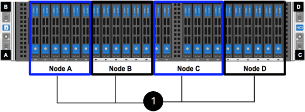

= Installez les nœuds de stockage H-Series
:allow-uri-read: 
:icons: font
:imagesdir: ../media/

[role="lead"]
Avant de commencer avec votre système de stockage 100 % Flash, il est conseillé d'installer et de configurer correctement les nœuds de stockage.

TIP: Voir la link:../media/hseries_isi.pdf["affiche"^] pour une représentation visuelle des instructions.

*  diagrams
*  for installation
*  the rails
*  and cable the nodes
*  the nodes
*  a cluster

== Diagrammes de flux de travail

Les schémas de flux de travail présentés ici fournissent un aperçu général des étapes d'installation. Les étapes varient légèrement selon le modèle de la série H.

=== H410S

image::../media/h410s_isi_workflow.png[Workflow d'installation H410S]

=== H610S

NOTE: Les termes « nœud » et « châssis » sont utilisés de manière interchangeable dans les cas d'H610S, car les nœuds et les châssis ne sont pas des composants distincts, contrairement à un châssis 2U à quatre nœuds.

image::../media/h610s_isi_workflow.png[Workflow d'installation H610S]

== Avant l'installation

Avant de procéder à l'installation, inventoriez le matériel qui vous a été expédié et contactez le support NetApp en cas de problème.

Assurez-vous que vous disposez des éléments suivants à votre emplacement d'installation :

* Espace rack pour le système.

[cols="2*"]
|===
| Type de nœud | D'espace rack 

| Nœuds H410S | Deux unités de rack (2U) 

| Nœuds H610S | Une unité de rack (1U) 
|===
* Câbles ou émetteurs-récepteurs SFP28/SFP+ à connexion directe
* Câbles Cat5e ou supérieur avec connecteur RJ45
* Un commutateur KVM (clavier, vidéo, souris) pour configurer votre système
* Clé USB (en option)

TIP: Le matériel qui vous est expédié dépend de ce que vous commandez. La nouvelle commande 2U à quatre nœuds comprend le châssis, le panneau, le kit de rails de coulissement, les lecteurs, les nœuds de stockage, et câbles d'alimentation (deux par châssis). Si vous commandez des nœuds de stockage H610S, les disques sont installés dans le châssis.

CAUTION: Lors de l'installation du matériel de fixation, assurez-vous de retirer tout le matériel d'emballage et l'emballage de l'unité. Cela empêchera les nœuds de surchauffer et de s'arrêter.

== Installer les rails

La commande de matériel qui vous a été expédiée comprend un jeu de rails coulissants. Vous aurez besoin d'un tournevis pour terminer l'installation du rail. Les étapes d'installation varient légèrement pour chaque modèle de nœud.

TIP: Installez le matériel de fixation du bas du rack jusqu'en haut pour éviter que l'équipement ne se renverse. Si votre rack comprend des dispositifs de stabilisation, installez-les avant d'installer le matériel.

* 
* 

=== H410S

Les nœuds H410S sont installés dans un châssis 2U H-Series à quatre nœuds livré avec deux jeux d'adaptateurs. Si vous souhaitez installer le châssis dans un rack à trous ronds, utilisez les adaptateurs appropriés pour un rack à trous ronds. Les rails pour les nœuds H410S s'adaptent à un rack de 29 pouces à 33.5 pouces de profondeur. Lorsque le rail est complètement engagé, sa longueur est de 28 pouces et les sections avant et arrière du rail sont maintenues ensemble par une seule vis.

CAUTION: Si vous installez le châssis sur un rail entièrement sous contrat, les sections avant et arrière du rail peuvent se séparer.

.Étapes
. Alignez l'avant du rail avec les trous du montant avant du rack.
. Poussez les crochets situés à l'avant du rail dans les trous du montant avant du rack, puis vers le bas, jusqu'à ce que les ergots à ressort s'enclenchent dans les trous du rack.
. Fixez le rail au rack à l'aide de vis. Voici une illustration du rail gauche fixé à l'avant du rack :
+
image::../media/h410s_rail.gif[Installation sur rail pour 2U]

. Étendre la section arrière du rail jusqu'au montant arrière du rack.
. Alignez les crochets à l'arrière du rail avec les trous appropriés sur le montant arrière, en vous assurant que l'avant et l'arrière du rail sont au même niveau.
. Montez l'arrière du rail sur le rack et fixez le rail à l'aide de vis.
. Effectuez toutes les étapes ci-dessus pour l'autre côté du rack.

=== H610S

Voici une illustration de l'installation des rails pour un nœud de stockage H610S :

image::../media/h610s_rail_isi.gif[Installation sur rail pour nœud de stockage H610S]

TIP: Il y a des rails gauche et droit sur les H610S. Positionnez le trou de vis vers le bas de manière à ce que la vis moletée puisse fixer le châssis sur le rail.

== Installez et câconnectez les nœuds

Vous installez le nœud de stockage H410S dans un châssis 2U à quatre nœuds. Pour H610S, installez le châssis/nœud directement sur les rails du rack.

CAUTION: Retirez tous les matériaux d'emballage et d'emballage de l'unité. Cela empêche la surchauffe et l'arrêt des nœuds.

* 
* 

=== H410S

.Étapes
. Installez les nœuds H410S dans le châssis. Voici un exemple de châssis avec quatre nœuds installés :
+
image::../media/sf_isi_chassis_rear.png[Cette figure illustre le dos d'un 2U]

+

WARNING: Prenez garde en soulevant le matériel et en l'installant dans le rack. Ce châssis à quatre nœuds vide pèse 24.7 kg (2 unités de rack 2U) et 54.45 3.6 kg (8.0 lb).

. Installez les disques.
+

. Câconnectez les nœuds.
+

IMPORTANT: Si les évents d'aération situés à l'arrière du châssis sont bloqués par des câbles ou des étiquettes, ils peuvent provoquer des défaillances prématurées de composants en raison d'une surchauffe.

+
image::../media/hci_isi_storage_cabling.png[Cette figure montre le câblage d'un nœud de stockage H410S.]

+
** Connectez deux câbles CAT5e ou supérieur dans les ports A et B pour la connectivité de gestion.
** Connectez deux câbles SFP28/SFP+ ou des émetteurs-récepteurs dans les ports C et D pour la connectivité du stockage.
** (Facultatif, recommandé) Connectez un câble CAT5e au port IPMI pour la connectivité de gestion hors bande.

. Branchez les câbles d'alimentation aux deux unités d'alimentation par châssis et branchez-les sur une prise secteur ou une prise secteur de 240 V.
. Mettez les nœuds sous tension.
+

NOTE: Le démarrage du nœud prend environ six minutes.

+
image::../media/hci_poweron_isg.gif[Cette figure présente les boutons d'alimentation des nœuds dans le 2U]

=== H610S

.Étapes
. Installez le châssis H610S. Voici une illustration de l'installation du nœud/châssis sur le rack :
+
image::../media/h610s_chassis_isi.gif[Affiche le nœud/châssis H610S en cours d'installation dans le rack.]

+

WARNING: Prenez garde en soulevant le matériel et en l'installant dans le rack. Un châssis H610S pèse 18.4 kg (40.5 lb).

. Câconnectez les nœuds.
+

IMPORTANT: Si les évents d'aération situés à l'arrière du châssis sont bloqués par des câbles ou des étiquettes, ils peuvent provoquer des défaillances prématurées de composants en raison d'une surchauffe.

+
image::../media/h600s_isi_noderear.png[Cette figure montre le câblage du nœud de stockage H610S]

+
** Connectez le nœud à un réseau 10 GbE à l'aide de deux câbles SFP28 ou SFP+.
** Connectez le nœud à un réseau 1 GbE à l'aide de deux connecteurs RJ45.
** Connectez le nœud à un réseau 1 GbE à l'aide d'un connecteur RJ-45 dans le port IPMI.
** Connectez les deux câbles d'alimentation au nœud.

. Mettez les nœuds sous tension.
+

NOTE: Le démarrage du nœud prend environ cinq minutes et 30 secondes.

+
image::../media/h600s_isi_nodefront.png[Cette figure montre l'avant du châssis H610S avec le bouton d'alimentation mis en surbrillance.]

== Configurez les nœuds

Une fois le matériel rack et les câbles requis, vous êtes prêt à configurer votre nouvelle ressource de stockage.

.Étapes
. Connectez un clavier et un moniteur au nœud.
. Dans l'interface utilisateur du terminal (TUI) qui s'affiche, configurez les paramètres réseau et cluster du nœud à l'aide du système de navigation à l'écran.
+

NOTE: Vous devez obtenir l'adresse IP du nœud à partir de la TUI. Vous en avez besoin lorsque vous ajoutez le nœud à un cluster. Une fois les paramètres enregistrés, le nœud est en attente et peut être ajouté à un cluster. Consultez le <insert link to Setup section>.

. Configurez la gestion hors bande à l'aide du contrôleur BMC (Baseboard Management Controller). Ces étapes s'appliquent uniquement aux nœuds H610S*.
+
.. Utilisez un navigateur Web et accédez à l'adresse IP BMC par défaut : 192.168.0.120
.. Connectez-vous en utilisant *root* comme nom d'utilisateur et *calvin* comme mot de passe.
.. Dans l'écran de gestion des nœuds, accédez à *Paramètres* > *Paramètres réseau* et configurez les paramètres réseau pour le port de gestion hors bande.

TIP: Voir https://kb.netapp.com/Advice_and_Troubleshooting/Hybrid_Cloud_Infrastructure/NetApp_HCI/How_to_access_BMC_and_change_IP_address_on_H610S["Cet article de la base de connaissances (connexion requise)"].

== Création d'un cluster

Après avoir ajouté le nœud de stockage à votre installation et configuré la nouvelle ressource de stockage, vous êtes prêt à créer un nouveau cluster de stockage

.Étapes
. À partir d'un client sur le même réseau que le nœud qui vient d'être configuré, accédez à l'interface utilisateur du logiciel NetApp Element en entrant l'adresse IP du nœud.
. Saisissez les informations requises dans la fenêtre **Créer un nouveau cluster**. Voir la link:../setup/concept_setup_overview.html["présentation de l'installation"^] pour en savoir plus.

== Trouvez plus d'informations

* https://www.netapp.com/data-storage/solidfire/documentation/["Page des ressources NetApp SolidFire"^]
* https://docs.netapp.com/sfe-122/topic/com.netapp.ndc.sfe-vers/GUID-B1944B0E-B335-4E0B-B9F1-E960BF32AE56.html["Documentation relative aux versions antérieures des produits NetApp SolidFire et Element"^]

