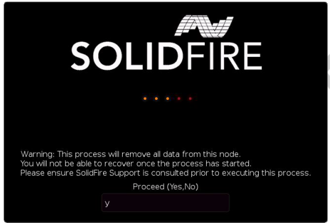

= Le processus RTFI
:allow-uri-read: 
:icons: font
:imagesdir: ../media/

[role="lead"]
Vous pouvez lancer le processus de retour à l'image d'usine (RTFI) en interagissant avec le nœud via des invites de console texte qui s'affichent avant le démarrage du système.

WARNING: Le processus RTFI est destructeur de données et efface en toute sécurité toutes les données et les détails de configuration du nœud et installe un nouveau système d'exploitation. Vérifiez que le nœud utilisé pour le processus RTFI n'est pas actif dans le cadre d'un cluster.

Le processus RTFI effectue les opérations de haut niveau suivantes :

. Démarre l'installation après la confirmation de l'utilisateur et valide l'image.
. Déverrouille tous les lecteurs d'un nœud.
. Valide et clignote le micrologiciel.
. Contrôle le matériel.
. Teste le matériel.
. Secure efface tous les lecteurs sélectionnés.
. Divise le disque racine et crée des systèmes de fichiers.
. Monte et décompresse l'image.
. Configure le nom d'hôte, la mise en réseau (Dynamic Host Configuration Protocol), la configuration de cluster par défaut et le chargeur d'amorçage GRUB.
. Arrête tous les services, collecte les journaux et redémarre.

Pour configurer votre nœud une fois le processus RTFI terminé, reportez-vous à la section https://docs.netapp.com/us-en/element-software/index.html["Documentation relative à la version de votre logiciel Element"^]. Une fois qu'un nœud a terminé avec succès le processus RTFI, il passe à l'état _Available_ (non configuré) par défaut.

== Effectuer le processus RTFI

Utilisez la procédure suivante pour restaurer le logiciel Element sur votre nœud SolidFire.

Pour plus d'informations sur la création d'une clé USB ou sur l'utilisation du contrôleur BMC pour exécuter le processus RTFI, reportez-vous à la section xref:task_rtfi_deployment_and_install_options.adoc[Options de déploiement et d'installation de RTFI].

.Avant de commencer
Vérifiez que vous répondez aux exigences suivantes :

* Vous avez accès à une console pour le nœud SolidFire.
* Le nœud sur lequel vous exécutez le processus RTFI est sous tension et connecté à un réseau.
* Le nœud sur lequel vous exécutez le processus RTFI ne fait pas partie d'un cluster actif.
* Vous avez accès à un support d'installation amorçable contenant l'image de la version adéquate du logiciel Element pour votre configuration.

Contactez le support NetApp en cas de problème avant d'effectuer le processus de retour sur IP.

.Étapes
. Connectez un moniteur et un clavier à l'arrière du nœud ou connectez-vous à l'interface utilisateur IP du contrôleur BMC et ouvrez la console *iKVM/HTML5* à partir de l'onglet *Remote Control* de l'interface utilisateur.
. Insérez une clé USB contenant une image appropriée dans l'un des deux emplacements USB situés à l'arrière du nœud.
. Mettez le nœud sous tension ou redémarrez-le. Au démarrage, sélectionnez Boot Device en sélectionnant *F11*:
+

NOTE: Vous devez sélectionner *F11* plusieurs fois en succession rapide car l'écran Boot Device (périphérique d'amorçage) passe rapidement.

. Dans le menu de sélection du périphérique d'amorçage, mettez l'option USB en surbrillance.
+
Les options qui s'affichent dépendent de la marque USB que vous utilisez.

+
[NOTE]
====
Si aucun périphérique USB n'est répertorié, accédez au BIOS, vérifiez que le périphérique USB est répertorié dans l'ordre de démarrage, redémarrez et réessayez.

Si cela ne résout pas le problème, accédez au BIOS, accédez à l'onglet *Enregistrer et Quitter*, sélectionnez *Restaurer sur les valeurs par défaut optimisées*, acceptez et enregistrez les paramètres, puis redémarrez.

====
. Une liste des images qui se trouvent sur le périphérique USB en surbrillance s'affiche. Sélectionnez la version souhaitée et sélectionnez ENTER pour démarrer le processus RTFI.
+
Le nom et le numéro de version du logiciel de l'élément d'image RTFI s'affichent.

. Dans l'invite initiale, vous êtes informé que le processus supprime toutes les données du nœud et que les données ne peuvent pas être récupérées une fois le processus démarré. Saisissez *Oui* pour commencer.
+

WARNING: Toutes les données et les informations de configuration sont effacées définitivement du nœud après l'exécution du processus. Si vous choisissez de ne pas continuer, vous êtes dirigé vers le xref:task_rtfi_options_menu.html[Menu d'options RTFI].

+

NOTE: Si vous souhaitez regarder la console pendant le processus RTFI, vous pouvez appuyer sur les touches *ALT+F8* pour basculer vers la console de mode détaillé. Appuyez sur *ALT+F7* pour revenir à l'interface utilisateur principale.

. Entrez *non* lorsque vous êtes invité à effectuer des tests matériels complets sauf si vous avez une raison de suspecter une défaillance matérielle ou si vous êtes invité à effectuer les tests par le support NetApp.
+
Un message indique que le processus RTFI est terminé et que le système s'éteint.

. Si nécessaire, retirez tous les supports d'installation amorçables après la mise hors tension du nœud.
+
Le nœud est maintenant prêt à être mis sous tension et configuré. Voir la https://docs.netapp.com/us-en/element-software/setup/concept_setup_overview.html["Documentation de configuration du stockage fournie par le logiciel Element"^] pour configurer le nœud de stockage.

+
Si vous avez rencontré un message d'erreur pendant le processus RTFI, reportez-vous à la section xref:task_rtfi_options_menu.html[Menu d'options RTFI].

== Trouvez plus d'informations

* https://docs.netapp.com/us-en/element-software/index.html["Documentation SolidFire et Element"]
* https://docs.netapp.com/sfe-122/topic/com.netapp.ndc.sfe-vers/GUID-B1944B0E-B335-4E0B-B9F1-E960BF32AE56.html["Documentation relative aux versions antérieures des produits NetApp SolidFire et Element"^]

