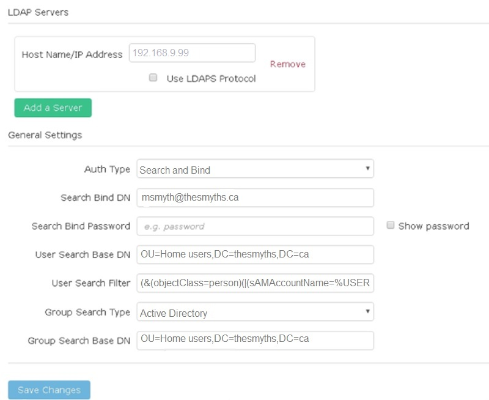

= Gérez LDAP
:allow-uri-read: 
:icons: font
:imagesdir: ../media/

[role="lead"]
Vous pouvez configurer le protocole LDAP (Lightweight Directory Access Protocol) pour activer la fonctionnalité de connexion sécurisée basée sur des répertoires au stockage SolidFire. Vous pouvez configurer LDAP au niveau du cluster et autoriser des utilisateurs et des groupes LDAP.

La gestion du protocole LDAP implique la configuration de l'authentification LDAP sur un cluster SolidFire à l'aide d'un environnement Microsoft Active Directory existant et le test de la configuration.

NOTE: Vous pouvez utiliser les adresses IPv4 et IPv6.

L'activation du protocole LDAP implique les étapes générales suivantes, décrites en détail :

. *Effectuer les étapes de pré-configuration pour la prise en charge du protocole LDAP*. Vérifiez que vous disposez de tous les détails nécessaires à la configuration de l'authentification LDAP.
. *Activer l'authentification LDAP*. Utilisez l'interface utilisateur Element ou l'API Element.
. *Valider la configuration LDAP*. Vous pouvez également vérifier que le cluster est configuré avec les valeurs correctes en exécutant la méthode GetLdapConfiguration API ou en vérifiant la configuration LCAP à l'aide de l'interface utilisateur Element.
. *Tester l'authentification LDAP* (avec le `readonly` utilisateur). Vérifiez que la configuration LDAP est correcte soit en exécutant la méthode TestLdapAuthentication API soit en utilisant l'interface utilisateur Element. Pour ce test initial, utilisez le nom d'utilisateur "sAMAccountName" de l' `readonly` utilisateur. Cela permet de vérifier que votre cluster est configuré correctement pour l'authentification LDAP et de valider également que `readonly` les identifiants et l'accès sont corrects. Si cette étape échoue, répétez les étapes 1 à 3.
. *Tester l'authentification LDAP* (avec un compte utilisateur que vous souhaitez ajouter). Répétez setp 4 avec un compte utilisateur que vous souhaitez ajouter en tant qu'administrateur de cluster Element. Copiez le `distinguished` Nom (DN) ou utilisateur (ou groupe). Ce DN sera utilisé à l'étape 6.
. *Ajouter le cluster LDAP admin* (copiez et collez le DN à partir de l'étape d'authentification LDAP de test). En utilisant soit l'interface utilisateur Element soit la méthode de l'API AddapClusterAdmin, créez un nouvel utilisateur administrateur cluster avec le niveau d'accès approprié. Pour le nom d'utilisateur, collez le nom d'utilisateur complet que vous avez copié à l'étape 5. Cela garantit que le DN est correctement formaté.
. *Tester l'accès admin du cluster*. Connectez-vous au cluster à l'aide du nouvel utilisateur administrateur de cluster LDAP. Si vous avez ajouté un groupe LDAP, vous pouvez vous connecter en tant qu'utilisateur de ce groupe.

== Suivez les étapes de pré-configuration pour la prise en charge du protocole LDAP

Avant d'activer la prise en charge LDAP dans Element, vous devez configurer un serveur Windows Active Directory Server et effectuer d'autres tâches de préconfiguration.

.Étapes
. Configurer un serveur Windows Active Directory.
. *Facultatif:* activez la prise en charge LDAPS.
. Créer des utilisateurs et des groupes.
. Créez un compte de service en lecture seule (tel que «`sfreadonly`) à utiliser pour la recherche dans l'annuaire LDAP.

== Activez l'authentification LDAP à l'aide de l'interface utilisateur Element

Vous pouvez configurer l'intégration du système de stockage avec un serveur LDAP existant. Les administrateurs LDAP peuvent ainsi gérer de façon centralisée l'accès au système de stockage pour les utilisateurs.

Vous pouvez configurer LDAP à l'aide de l'interface utilisateur Element ou de l'API Element. Cette procédure explique comment configurer LDAP à l'aide de l'interface utilisateur Element.

Cet exemple montre comment configurer l'authentification LDAP sur SolidFire et qu'elle utilise `SearchAndBind` comme type d'authentification. L'exemple utilise un seul serveur Active Directory Windows Server 2012 R2.

.Étapes
. Cliquez sur *Cluster* > *LDAP*.
. Cliquez sur *Oui* pour activer l'authentification LDAP.
. Cliquez sur *Ajouter un serveur*.
. Saisissez *Nom d'hôte/adresse IP*.
+

NOTE: Un numéro de port personnalisé facultatif peut également être saisi.

+
Par exemple, pour ajouter un numéro de port personnalisé, entrez <nom d'hôte ou adresse ip> :<numéro de port>

. *Facultatif:* sélectionnez *utiliser le protocole LDAPS*.
. Entrez les informations requises dans *Paramètres généraux*.
+

. Cliquez sur *Activer LDAP*.
. Cliquez sur *Tester l'authentification utilisateur* si vous souhaitez tester l'accès au serveur pour un utilisateur.
. Copiez le nom distinctif et les informations sur le groupe d'utilisateurs qui s'affichent pour une utilisation ultérieure lors de la création d'administrateurs de cluster.
. Cliquez sur *Enregistrer les modifications* pour enregistrer les nouveaux paramètres.
. Pour créer un utilisateur dans ce groupe afin que tout le monde puisse se connecter, procédez comme suit :
+
.. Cliquez sur *User* > *View*.
+
image::../media/element_new_cluster_admin.jpg[nouvel administrateur de cluster element]

.. Pour le nouvel utilisateur, cliquez sur *LDAP* pour le Type d'utilisateur et collez le groupe que vous avez copié dans le champ Nom unique.
.. Sélectionnez les autorisations, généralement toutes les autorisations.
.. Faites défiler jusqu'au contrat de licence utilisateur final et cliquez sur *J'accepte*.
.. Cliquez sur *Créer un administrateur de cluster*.
+
Maintenant, vous avez un utilisateur avec la valeur d'un groupe Active Directory.

Pour tester cette méthode, déconnectez-vous de l'interface utilisateur d'Element et reconnectez-vous en tant qu'utilisateur dans ce groupe.

== Activez l'authentification LDAP avec l'API Element

Vous pouvez configurer l'intégration du système de stockage avec un serveur LDAP existant. Les administrateurs LDAP peuvent ainsi gérer de façon centralisée l'accès au système de stockage pour les utilisateurs.

Vous pouvez configurer LDAP à l'aide de l'interface utilisateur Element ou de l'API Element. Cette procédure explique comment configurer LDAP à l'aide de l'API Element.

Pour exploiter l'authentification LDAP sur un cluster SolidFire, vous activez d'abord l'authentification LDAP sur le cluster à l'aide de `EnableLdapAuthentication` Méthode API.

.Étapes
. Activez d'abord l'authentification LDAP sur le cluster à l'aide de `EnableLdapAuthentication` Méthode API.
. Entrez les informations requises.
+
[listing]
----
{
     "method":"EnableLdapAuthentication",
     "params":{
          "authType": "SearchAndBind",
          "groupSearchBaseDN": "dc=prodtest,dc=solidfire,dc=net",
          "groupSearchType": "ActiveDirectory",
          "searchBindDN": "SFReadOnly@prodtest.solidfire.net",
          "searchBindPassword": "ReadOnlyPW",
          "userSearchBaseDN": "dc=prodtest,dc=solidfire,dc=net ",
          "userSearchFilter": "(&(objectClass=person)(sAMAccountName=%USERNAME%))"
          "serverURIs": [
               "ldap://172.27.1.189",
          [
     },
  "id":"1"
}
----
. Modifiez les valeurs des paramètres suivants :
+
[cols="2*"]
|===
| Paramètres utilisés | Description 

 a| 
AuthType : SearchAndBind
 a| 
Indique que le cluster utilisera le compte de service readonly pour rechercher d'abord l'utilisateur authentifié et lier ensuite cet utilisateur s'il est trouvé et authentifié.

 a| 
GroupSearchBaseDN : dc=prodtest,dc=solidfire,dc=net
 a| 
Spécifie l'emplacement dans l'arborescence LDAP pour commencer la recherche de groupes. Pour cet exemple, nous avons utilisé la racine de notre arbre. Si votre arborescence LDAP est très grande, vous pouvez le définir sur une sous-arborescence plus granulaire pour réduire les temps de recherche.

 a| 
UserSearchBaseDN : dc=prodtest,dc=solidfire,dc=net
 a| 
Indique l'emplacement dans l'arborescence LDAP pour commencer la recherche d'utilisateurs. Pour cet exemple, nous avons utilisé la racine de notre arbre. Si votre arborescence LDAP est très grande, vous pouvez le définir sur une sous-arborescence plus granulaire pour réduire les temps de recherche.

 a| 
GroupSearchType : ActiveDirectory
 a| 
Utilise le serveur Windows Active Directory comme serveur LDAP.

 a| 
[listing]
----
userSearchFilter:
“(&(objectClass=person)(sAMAccountName=%USERNAME%))”
----
Pour utiliser userPrincipalName (adresse e-mail pour la connexion), vous pouvez remplacer userSearchFilter par :

[listing]
----
“(&(objectClass=person)(userPrincipalName=%USERNAME%))”
----
Ou, pour effectuer une recherche à la fois userPrincipalName et sAMAccountName, vous pouvez utiliser le userSearchFilter suivant :

[listing]
----
“(&(objectClass=person)(
----| (SAMAccountName=%USERNAME%)(userPrincipalName=%USERNAME%))» ---- 

 a| 
Utilise sAMAccountName comme nom d'utilisateur pour la connexion à la grappe SolidFire. Ces paramètres indiquent à LDAP de rechercher le nom d'utilisateur spécifié lors de la connexion dans l'attribut sAMAccountName et limitent également la recherche à des entrées dont la valeur est « personne » dans l'attribut objectClass.
 a| 
SearchBindDN

 a| 
Il s'agit du nom distinctif de l'utilisateur readonly qui sera utilisé pour effectuer une recherche dans l'annuaire LDAP. Pour le répertoire actif, il est généralement plus facile d'utiliser le nom d'utilisateur en titre (format d'adresse e-mail) pour l'utilisateur.
 a| 
SearchBindPassword

|===

Pour tester cette méthode, déconnectez-vous de l'interface utilisateur d'Element et reconnectez-vous en tant qu'utilisateur dans ce groupe.

== Afficher les détails LDAP

Affichez les informations LDAP sur la page LDAP de l'onglet Cluster.

NOTE: Vous devez activer LDAP pour afficher ces paramètres de configuration LDAP.

. Pour afficher les détails LDAP avec l'interface utilisateur d'élément, cliquez sur *Cluster* > *LDAP*.
+
** *Nom d'hôte/adresse IP* : adresse d'un serveur d'annuaire LDAP ou LDAPS.
** *Type d'authentification* : méthode d'authentification de l'utilisateur. Valeurs possibles :
+
*** Liaison directe
*** Rechercher et lier

** *Rechercher un DN de liaison* : un DN complet pour se connecter avec pour effectuer une recherche LDAP pour l'utilisateur (nécessite un accès de niveau de liaison à l'annuaire LDAP).
** *Search Bind Password* : mot de passe utilisé pour authentifier l'accès au serveur LDAP.
** *Recherche utilisateur DN de base* : le DN de base de l'arborescence utilisée pour lancer la recherche utilisateur. Le système recherche la sous-arborescence à partir de l'emplacement spécifié.
** *Filtre de recherche d'utilisateur* : saisissez ce qui suit en utilisant votre nom de domaine :
+
`(&(objectClass=person)(|(sAMAccountName=%USERNAME%)(userPrincipalName=%USERNAME%)))`

** *Type de recherche de groupe* : type de recherche qui contrôle le filtre de recherche de groupe par défaut utilisé. Valeurs possibles :
+
*** Active Directory : appartenance imbriquée à tous les groupes LDAP d'un utilisateur.
*** Aucun groupe : aucun support de groupe.
*** DN du membre : groupes de style DN du membre (niveau unique).

** *Recherche de groupe DN de base* : le DN de base de l'arborescence utilisée pour lancer la recherche de groupe. Le système recherche la sous-arborescence à partir de l'emplacement spécifié.
** *Tester l'authentification utilisateur* : une fois le protocole LDAP configuré, utilisez-le pour tester le nom d'utilisateur et l'authentification par mot de passe pour le serveur LDAP. Saisissez un compte déjà existant pour le tester. Les informations relatives au nom distinctif et au groupe d'utilisateurs s'affichent, que vous pouvez copier pour une utilisation ultérieure lors de la création d'administrateurs de cluster.

== Testez la configuration LDAP

Après avoir configuré LDAP, vous devez le tester à l'aide de l'interface utilisateur d'Element ou de l'API d'Element `TestLdapAuthentication` méthode.

.Étapes
. Pour tester la configuration LDAP avec l'interface utilisateur Element, procédez comme suit :
+
.. Cliquez sur *Cluster* > *LDAP*.
.. Cliquez sur *Test authentification LDAP*.
.. Pour résoudre les problèmes, utilisez les informations du tableau ci-dessous :
+
[cols="2*"]
|===
| Message d'erreur | Description 

 a| 
 xLDAPUserNotFound a| 
*** L'utilisateur en cours de test est introuvable dans la configuration `userSearchBaseDN` sous-arbre.
*** Le `userSearchFilter` n'est pas configuré correctement.

 a| 
 xLDAPBindFailed (Error: Invalid credentials) a| 
*** Le nom d'utilisateur testé est un utilisateur LDAP valide, mais le mot de passe fourni est incorrect.
*** Le nom d'utilisateur testé est un utilisateur LDAP valide, mais le compte est actuellement désactivé.

 a| 
 xLDAPSearchBindFailed (Error: Can't contact LDAP server) a| 
L'URI du serveur LDAP est incorrecte.

 a| 
 xLDAPSearchBindFailed (Error: Invalid credentials) a| 
Le nom d'utilisateur ou le mot de passe en lecture seule n'est pas configuré correctement.

 a| 
 xLDAPSearchFailed (Error: No such object) a| 
Le `userSearchBaseDN` N'est pas un emplacement valide dans l'arborescence LDAP.

 a| 
 xLDAPSearchFailed (Error: Referral) a| 
*** Le `userSearchBaseDN` N'est pas un emplacement valide dans l'arborescence LDAP.
*** Le `userSearchBaseDN` et `groupSearchBaseDN` Sont dans une UO imbriquée. Cela peut entraîner des problèmes de permission. La solution consiste à inclure l'UO dans les entrées DN de base d'utilisateur et de groupe (par exemple : `ou=storage, cn=company, cn=com`)

|===

. Pour tester la configuration LDAP avec l'API Element, procédez comme suit :
+
.. Appelez la méthode TestLdapAuthentication.
+
[listing]
----
{
  "method":"TestLdapAuthentication",
     "params":{
        "username":"admin1",
        "password":"admin1PASS
      },
      "id": 1
}
----
.. Passez en revue les résultats. Si l'appel API réussit, les résultats incluent le nom distinctif de l'utilisateur spécifié et une liste de groupes dans lesquels l'utilisateur est membre.
+
[listing]
----
{
"id": 1
     "result": {
         "groups": [
              "CN=StorageMgmt,OU=PTUsers,DC=prodtest,DC=solidfire,DC=net"
         ],
         "userDN": "CN=Admin1 Jones,OU=PTUsers,DC=prodtest,DC=solidfire,DC=net"
     }
}
----

== Désactivez LDAP

Vous pouvez désactiver l'intégration LDAP à l'aide de l'interface utilisateur Element.

Avant de commencer, notez tous les paramètres de configuration, car la désactivation du protocole LDAP efface tous les paramètres.

.Étapes
. Cliquez sur *Cluster* > *LDAP*.
. Cliquez sur *non*.
. Cliquez sur *Désactiver LDAP*.

== Trouvez plus d'informations

* https://docs.netapp.com/us-en/element-software/index.html["Documentation SolidFire et Element"]
* https://docs.netapp.com/us-en/vcp/index.html["Plug-in NetApp Element pour vCenter Server"^]

