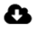

= Icônes de l'interface Element
:allow-uri-read: 
:icons: font
:imagesdir: ../media/

[role="lead"]
L'interface du logiciel NetApp Element affiche des icônes représentant les actions que vous pouvez effectuer sur les ressources système.

Le tableau suivant fournit une référence rapide :

|===

| Icône | Description 

 a| 
image:../media/element_icon_action.gif["Icône actions dans l'interface utilisateur Web Element OS"]
 a| 
Actions

 a| 
image:../media/element_icon_backupto.gif["Icône Backupto dans l'interface utilisateur Web d'Element OS"]
 a| 
Sauvegarde sur

 a| 
image:../media/element_icon_clone.gif["Icône de clonage dans l'interface utilisateur Web Element OS"]
 a| 
Cloner ou copier

 a| 
image:../media/element_icon_delete.gif["Icône de suppression dans l'interface utilisateur Web Element OS"]
 a| 
Supprimer ou purger

 a| 
image:../media/element_icon_edit.gif["Icône Modifier dans l'interface utilisateur Web Element OS"]
 a| 
Modifier

 a| 

 a| 
Filtre

 a| 
image:../media/element_icon_pair.gif["Icône de paire dans l'interface utilisateur Web Element OS"]
 a| 
Paire

 a| 
image:../media/element_icon_refresh.gif["Icône d'actualisation dans l'interface utilisateur Web Element OS"]
 a| 
Actualisez

 a| 
image:../media/element_icon_restore.gif["Icône de restauration dans l'interface utilisateur Web Element OS"]
 a| 
Restaurer

 a| 

 a| 
Source de restauration

 a| 
image:../media/element_icon_rollback.gif["Icône de restauration dans l'interface utilisateur Web Element OS"]
 a| 
Retour arrière

 a| 
image:../media/element_icon_snapshot.gif["Icône Snapshot dans l'interface utilisateur Web Element OS"]
 a| 
Snapshot

|===