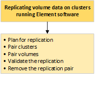

= Réplication à distance entre les clusters exécutant le logiciel NetApp Element
:allow-uri-read: 
:icons: font
:imagesdir: ../media/

[role="lead"]
Pour les clusters exécutant le logiciel Element, la réplication en temps réel permet de créer rapidement des copies distantes des données de volume. Vous pouvez associer un cluster de stockage à quatre autres clusters de stockage maximum. Il peut répliquer des données de volume de manière synchrone ou asynchrone à partir de l'un des clusters d'une paire de clusters pour effectuer des scénarios de basculement et de restauration.

Le processus de réplication comprend les étapes suivantes :

* link:task_replication_plan_cluster_and_volume_pairing.html["Planifiez l'association des clusters et des volumes pour la réplication en temps réel"]
* link:task_replication_pair_clusters.html["Coupler les clusters pour la réplication"]
* link:task_replication_pair_volumes.html["Coupler les volumes"]
* link:task_replication_validate_volume_replication.html["Validation de la réplication de volume"]
* link:task_replication_delete_volume_relationship_after_replication.html["Supprime une relation de volume après la réplication"]
* link:task_replication_manage_volume_relationships.html["Gestion des relations de volume"]

